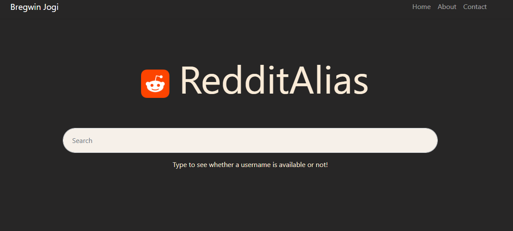

# Reddit Username Availability Checker



Ever wanted to find a unique reddit account without spending time in the user registration page? This website lets find your perfect username.

Made with React in the Frontend and Flask for the Backend

There are two folders: 

### Frontend

Install npm modules:
```
npm install
```

Run with: 
```
npm start
```


### Backend

Install packages:
```
pip install -r requirements.txt
```

Run with: 
```
flask --app main run
```